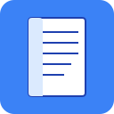

# Lector Manga/Comic

Un lector de PDFs y cómics construido con Rust yegui, diseñado para lectura de manga y comics en Linux.



## Características

- Navegación de archivos integrada
- Control de zoom y páginas
- Guardado automático de progreso por archivo
- Interfaz fluida y responsiva
- Navegación con teclado (flechas, +/-)

## Instalación

### Requisitos

- Linux (probado en Arch Linux con Hyprland)
- Rust (si compilás desde código fuente)

### Método 1: Binario precompilado

```bash
# Descargá el binario de Releases y ejecutá:
sudo cp lector-pdf /usr/local/bin/lector
sudo chmod +x /usr/local/bin/lector
lector
```

### Método 2: Compilación desde código fuente

```bash
# Clonar el repositorio
git clone https://github.com/Brextal/Lector-Manga-Comic.git
cd Lector-Manga-Comic

# Compilar
cargo build --release

# Instalar
sudo cp target/release/lector-pdf /usr/local/bin/lector
sudo chmod +x /usr/local/bin/lector
```

## Configuración del Launcher (Linux)

El archivo `.desktop` ya está incluido para aparecer en tu launcher de aplicaciones.

### Icono

El icono se encuentra en `icons/lector.png`. Para que aparezca correctamente:

```bash
mkdir -p ~/.local/share/icons/hicolor/128x128/apps
cp icons/lector.png ~/.local/share/icons/hicolor/128x128/apps/lector.png
```

## Uso

1. Ejecutá `lector` o buscá "Lector Manga/Comic" en tu launcher
2. Navegá por tus carpetas usando los botones
3. Seleccioná un archivo PDF para abrirlo
4. Usá los botones o teclado para navegar:
   - `Ant.` / `Sig.` - Página anterior/siguiente
   - `+` / `-` - Zoom in/out
   - `<-` / `->` - Navegación con teclado
   - `Escape` - Volver al navegador de archivos

## Estructura del Proyecto

```
lector-pdf/
├── src/
│   ├── main.rs          # Punto de entrada
│   ├── lib.rs           # Módulos del proyecto
│   ├── app_state.rs    # Gestión de estado/guardado
│   ├── file_browser.rs # Navegador de archivos
│   └── pdf_viewer.rs    # Visor de PDFs
├── icons/               # Iconos de la aplicación
├── Cargo.toml          # Dependencias
└── README.md           # Este archivo
```

## Licencia

MIT

## Contribuciones

¡Las contribuciones son bienvenidas! Por favor, realizá un fork del proyecto y enviá un pull request.